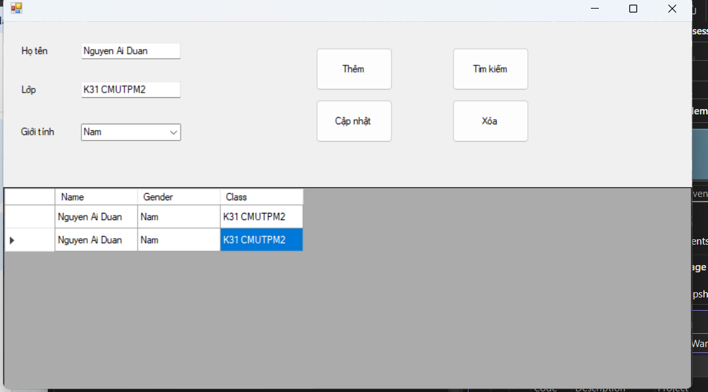
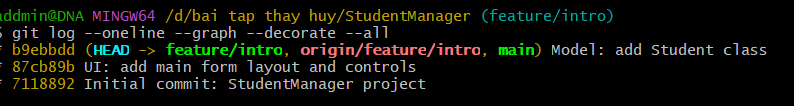

# StudentManager

## Mô tả
Ứng dụng quản lý sinh viên (thêm/sửa/xóa/tìm kiếm) với giao diện đơn giản. Dự án dùng C# WinForms (.NET), lưu dữ liệu tạm thời trong bộ nhớ để minh họa quy trình Git.

---

## Hướng dẫn chạy
1. Mở file `.sln` bằng Visual Studio 2022.
2. Restore packages nếu có: `Tools > NuGet Package Manager > Restore`.
3. Chọn cấu hình `Debug` và nhấn `Start`.
4. Tại màn hình chính, thử thêm sinh viên, sửa, xóa, và dùng ô tìm kiếm để lọc.

---

## 5 commit chính
- Initial commit: StudentManager project — Khởi tạo dự án.
- UI: add main form layout and controls — Thêm form chính và control.
- Model: add Student class — Tạo lớp Student.
- Feature: implement add/update/delete — Viết chức năng CRUD.
- Feature: add search function — Thêm tìm kiếm.

---

## Pull Request
- PR: feature/intro → main  
  Link: https://github.com/DNA2007/NguyenAiDuan_37799_StudentManager/pull/<so_PR>

---

## Ảnh UI ứng dụng

---

## Ảnh log hoặc link log
- Ảnh:

- Hoặc link Commits: https://github.com/DNA2007/NguyenAiDuan_37799_StudentManager/new/feature/intro?filename=README.md/commits/main
